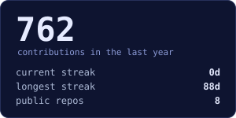
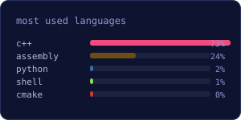

 

<samp>maaz hussain &nbsp;·&nbsp; cs @ fast &nbsp;·&nbsp; islamabad, pk</samp>

---

<samp>// languages</samp>

<samp>// tools</samp>

---

<samp>// stats</samp>

&nbsp;

---

<samp>// activity</samp>

---

<samp>// connect</samp>

[**github**](https://github.com/artificial-maaz) &nbsp;·&nbsp; [**email**](mailto:maazhussain.work@gmail.com) &nbsp;·&nbsp; [**linkedin**](https://www.linkedin.com/in/maazhussainfast)

 

